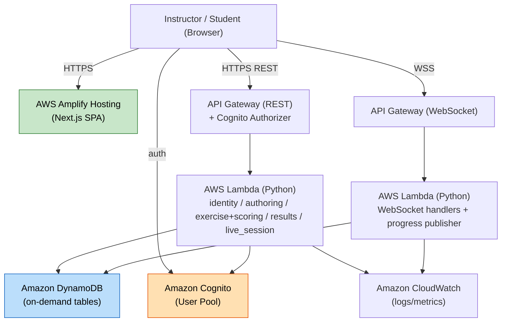

# Deployment Architecture — ProcessCanvas (Shared)

## Architecture Diagram

### Text Alternative
- Browser loads the Next.js SPA from AWS Amplify Hosting.
- Browser authenticates with Cognito; calls REST API Gateway (Cognito authorizer) for standard actions.
- Browser opens a WSS connection to the WebSocket API Gateway for live-session progress.
- REST API Gateway invokes Python Lambdas (domain modules); WebSocket API invokes WebSocket Lambdas.
- Lambdas read/write DynamoDB and emit logs/metrics to CloudWatch.

## Environments
- **Single region**, serverless. Suggested environments: `dev` and `prod` (same stack, parameterized) — minimal at this scale.
- Amplify Hosting connected to the repo for CI/CD of the frontend; backend + infra deployed via CDK.

## Deployment Flow (CDK, single stack)
1. `cdk deploy` provisions: Cognito User Pool, DynamoDB tables, Lambda functions, REST + WebSocket API Gateways, IAM roles, CloudWatch log groups.
2. Frontend deployed via Amplify Hosting (build on push); configured with API + Cognito endpoints.
3. Seed data: system-seeded real-estate-development templates loaded into the Templates table (post-deploy seeding task).

## Cost / Scaling Posture
- Scale-to-zero serverless; pay-per-use. On-demand DynamoDB and Lambda concurrency comfortably cover ~100 concurrent users.

## Out of Scope (this iteration)
- Multi-region, WAF, custom alarms/SLA dashboards, VPC isolation (not required at this scale; can be added later).
