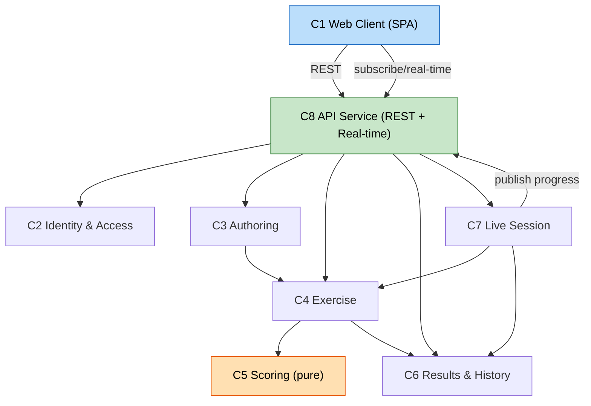

# Application Design — Component Dependencies & Data Flow

## Dependency Diagram

### Text Alternative (dependencies)
- C1 Web Client → C8 API Service (REST requests + real-time subscription).
- C8 API Service → C2 Identity & Access (authorize every protected request).
- C8 API Service → C3 Authoring, C4 Exercise, C6 Results & History, C7 Live Session (route/orchestrate).
- C3 Authoring → C4 Exercise (applyConfiguration generates/refreshes an exercise instance).
- C4 Exercise → C5 Scoring (compute score/feedback) and → C6 Results & History (record attempts).
- C7 Live Session → C4 Exercise (run submissions) and → C6 Results & History (record), and publishes progress back through C8's real-time channel.

## Dependency Matrix
| From \ To | C2 IAM | C3 Authoring | C4 Exercise | C5 Scoring | C6 History | C7 Live | C8 API |
|---|---|---|---|---|---|---|---|
| C1 Client | — | — | — | — | — | — | calls |
| C8 API | authz | calls | calls | — | calls | calls | — |
| C3 Authoring | — | — | creates | — | — | — | — |
| C4 Exercise | — | reads config | — | calls | calls | — | — |
| C7 Live | — | reads | calls | — | calls | — | publishes |

## Key Communication Patterns
- **Synchronous REST** for all standard CRUD/actions (Q5=A).
- **Real-time push** (WebSocket/AppSync) only for live-session progress (Q3=B): instructor subscribes; server publishes progress events.
- **Pure function call** from Exercise to Scoring (no I/O in Scoring) for testability and reproducibility (Q2=A).
- **Authorization gate** at the API service on every protected operation.

## Primary Data Flows
1. **Authoring → Exercise generation**: Instructor edits configuration → save → applyConfiguration → Exercise instance created/refreshed (prior placements/results cleared; past attempts preserved).
2. **Student submission**: getExercise → savePlacements → submit → Scoring.score → feedback (incorrect cards + weakest-match reflection) → recordAttempt.
3. **Correct-and-resubmit-once**: feedback shows incorrect cards → student edits → verifyRevision (review) → resubmit (one time) → final attempt recorded → locked.
4. **Live session**: instructor startSession → students joinSession → submissions scored via Exercise flow → progress aggregated → published to instructor in real time.
5. **History/results**: student getStudentHistory / instructor getClassResults (ownership-scoped, reproducible from stored data).
