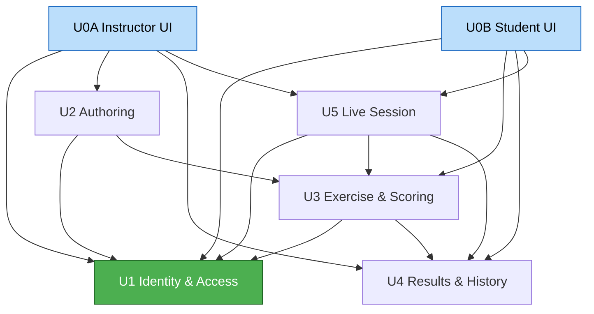

# Units of Work — Dependencies

## Dependency Diagram

### Text Alternative (dependencies)
- U0A Instructor UI → U1, U2, U4, U5
- U0B Student UI → U1, U3, U4, U5
- U2 Authoring → U1, U3
- U3 Exercise & Scoring → U1, U4
- U4 Results & History → U1
- U5 Live Session → U1, U3, U4
- U1 Identity & Access → (none; foundation)

## Dependency Matrix (row depends on column)
| Unit \ Depends on | U1 | U2 | U3 | U4 | U5 |
|---|---|---|---|---|---|
| U0A Instructor UI | ✔ | ✔ |  | ✔ | ✔ |
| U0B Student UI | ✔ |  | ✔ | ✔ | ✔ |
| U1 Identity & Access |  |  |  |  |  |
| U2 Authoring | ✔ |  | ✔ |  |  |
| U3 Exercise & Scoring | ✔ |  |  | ✔ |  |
| U4 Results & History | ✔ |  |  |  |  |
| U5 Live Session | ✔ |  | ✔ | ✔ |  |

## Update / Build Order (dependency-respecting)
1. **U1 Identity & Access** — no dependencies.
2. **U4 Results & History** — depends only on U1; define its data contracts early (U3 records into it).
3. **U3 Exercise & Scoring** — depends on U1, U4.
4. **U2 Authoring** — depends on U1, U3 (apply generates exercise).
5. **U5 Live Session** — depends on U1, U3, U4.
6. **U0A / U0B Frontend** — built against stabilized backend units; may proceed in vertical slices.

> Note: Foundation-first per Q5=A. U4 is pulled slightly earlier than the proposed numeric order
> because U3 depends on U4's persistence contracts. No circular dependencies exist.

## Coordination Points
- **Auth contract (U1)**: token format + `authorize()` semantics consumed by all units.
- **Configuration & exercise contract (U2↔U3)**: structure of phases/activities/weighted mappings and exercise instances.
- **Attempt/record contract (U3↔U4)**: shape of recorded attempts, scores, feedback, reflections.
- **Real-time progress contract (U5↔frontend)**: progress event schema + subscribe semantics.
