# Execution Plan — ProcessCanvas

## Detailed Analysis Summary

### Transformation Scope
- **Project Type**: Greenfield (no existing code; brownfield/reverse-engineering N/A)
- **Primary Changes**: Build a new serverless AWS web application from scratch (frontend SPA, REST API, scoring/domain logic, authentication, persistence, live-session support)

### Change Impact Assessment
- **User-facing changes**: Yes — full instructor and student experiences (authoring, sorting, scoring, feedback, history, live sessions)
- **Structural changes**: Yes — new system architecture (frontend + API + data)
- **Data model changes**: Yes — new schemas for users, configurations/templates, exercises, submissions/attempts, reflections, live sessions
- **API changes**: Yes — all new endpoints (auth, configurations, exercises, submissions, results, sessions)
- **NFR impact**: Yes — ~100 concurrent users, serverless-first hosting, responsiveness, role-based access

### Risk Assessment
- **Risk Level**: Low–Medium (greenfield, small scale, no production system to disrupt; main complexity is scoring + resubmit-once logic and multi-component coordination)
- **Rollback Complexity**: Easy (new project; no live data/users yet)
- **Testing Complexity**: Moderate (scoring/partial-credit and resubmit-once flows warrant focused unit tests)

## Workflow Visualization

```mermaid
flowchart TD
    Start(["User Request"])

    subgraph INCEPTION["INCEPTION PHASE"]
        WD["Workspace Detection<br/><b>COMPLETED</b>"]
        RA["Requirements Analysis<br/><b>COMPLETED</b>"]
        US["User Stories<br/><b>COMPLETED</b>"]
        WP["Workflow Planning<br/><b>COMPLETED</b>"]
        AD["Application Design<br/><b>EXECUTE</b>"]
        UG["Units Generation<br/><b>EXECUTE</b>"]
    end

    subgraph CONSTRUCTION["CONSTRUCTION PHASE"]
        FD["Functional Design<br/><b>EXECUTE</b>"]
        NFRA["NFR Requirements<br/><b>EXECUTE</b>"]
        NFRD["NFR Design<br/><b>EXECUTE</b>"]
        ID["Infrastructure Design<br/><b>EXECUTE</b>"]
        CG["Code Generation<br/><b>EXECUTE</b>"]
        BT["Build and Test<br/><b>EXECUTE</b>"]
    end

    subgraph OPERATIONS["OPERATIONS PHASE"]
        OPS["Operations<br/><b>PLACEHOLDER</b>"]
    end

    Start --> WD
    WD --> RA
    RA --> US
    US --> WP
    WP --> AD
    AD --> UG
    UG --> FD
    FD --> NFRA
    NFRA --> NFRD
    NFRD --> ID
    ID --> CG
    CG --> BT
    BT --> OPS
    BT --> End(["Complete"])

    style WD fill:#4CAF50,stroke:#1B5E20,stroke-width:3px,color:#fff
    style RA fill:#4CAF50,stroke:#1B5E20,stroke-width:3px,color:#fff
    style US fill:#4CAF50,stroke:#1B5E20,stroke-width:3px,color:#fff
    style WP fill:#4CAF50,stroke:#1B5E20,stroke-width:3px,color:#fff
    style AD fill:#FFA726,stroke:#E65100,stroke-width:3px,stroke-dasharray: 5 5,color:#000
    style UG fill:#FFA726,stroke:#E65100,stroke-width:3px,stroke-dasharray: 5 5,color:#000
    style FD fill:#FFA726,stroke:#E65100,stroke-width:3px,stroke-dasharray: 5 5,color:#000
    style NFRA fill:#FFA726,stroke:#E65100,stroke-width:3px,stroke-dasharray: 5 5,color:#000
    style NFRD fill:#FFA726,stroke:#E65100,stroke-width:3px,stroke-dasharray: 5 5,color:#000
    style ID fill:#FFA726,stroke:#E65100,stroke-width:3px,stroke-dasharray: 5 5,color:#000
    style CG fill:#4CAF50,stroke:#1B5E20,stroke-width:3px,color:#fff
    style BT fill:#4CAF50,stroke:#1B5E20,stroke-width:3px,color:#fff
    style OPS fill:#BDBDBD,stroke:#424242,stroke-width:2px,stroke-dasharray: 5 5,color:#000
    style INCEPTION fill:#BBDEFB,stroke:#1565C0,stroke-width:3px,color:#000
    style CONSTRUCTION fill:#C8E6C9,stroke:#2E7D32,stroke-width:3px,color:#000
    style OPERATIONS fill:#FFF59D,stroke:#F57F17,stroke-width:3px,color:#000
    style Start fill:#CE93D8,stroke:#6A1B9A,stroke-width:3px,color:#000
    style End fill:#CE93D8,stroke:#6A1B9A,stroke-width:3px,color:#000

    linkStyle default stroke:#333,stroke-width:2px
```

### Text Alternative (workflow)
- INCEPTION: Workspace Detection (COMPLETED) → Requirements Analysis (COMPLETED) → User Stories (COMPLETED) → Workflow Planning (COMPLETED) → Application Design (EXECUTE) → Units Generation (EXECUTE)
- CONSTRUCTION (per unit): Functional Design (EXECUTE) → NFR Requirements (EXECUTE) → NFR Design (EXECUTE) → Infrastructure Design (EXECUTE) → Code Generation (EXECUTE), then Build and Test (EXECUTE)
- OPERATIONS: Operations (PLACEHOLDER)

## Phases to Execute

### 🔵 INCEPTION PHASE
- [x] Workspace Detection (COMPLETED)
- [x] Reverse Engineering (SKIPPED — greenfield, no existing code)
- [x] Requirements Analysis (COMPLETED)
- [x] User Stories (COMPLETED)
- [x] Workflow Planning (IN PROGRESS)
- [ ] Application Design — **EXECUTE**
  - **Rationale**: New system with multiple components (frontend, API, auth, scoring/domain, persistence, live session). Component responsibilities, methods, and service boundaries need definition.
- [ ] Units Generation — **EXECUTE**
  - **Rationale**: System benefits from decomposition into units of work (e.g., Identity/Access, Authoring, Exercise & Scoring, Persistence/History, Live Session) with dependencies and a story map.

### 🟢 CONSTRUCTION PHASE (per unit)
- [ ] Functional Design — **EXECUTE**
  - **Rationale**: New data models/schemas and complex business logic (weighted scoring, partial-credit, multi-phase placement, correct-and-resubmit-once) require detailed design.
- [ ] NFR Requirements — **EXECUTE**
  - **Rationale**: Performance/scale (~100 concurrent), responsiveness, and serverless tech-stack selection must be set. (Security/Resiliency/PBT extensions opted out, but baseline NFRs still apply.)
- [ ] NFR Design — **EXECUTE**
  - **Rationale**: Incorporate NFR patterns (statelessness, caching/CDN, auth/access patterns, data access design) into the design.
- [ ] Infrastructure Design — **EXECUTE**
  - **Rationale**: Map to concrete serverless AWS services (frontend on S3 + AWS Amplify Hosting, API Gateway + Lambda, DynamoDB, Cognito) and deployment approach (IaC).
- [ ] Code Generation — **EXECUTE (ALWAYS)**
  - **Rationale**: Implementation planning and code generation for each unit.
- [ ] Build and Test — **EXECUTE (ALWAYS)**
  - **Rationale**: Build all units and run unit/integration tests, with focus on scoring and resubmit-once flows.

### 🟡 OPERATIONS PHASE
- [ ] Operations — **PLACEHOLDER** (future deployment/monitoring)

## Proposed Units of Work (preview — finalized in Units Generation)
1. **Identity & Access** — registration, login, roles, access control
2. **Instructor Authoring** — templates, configuration table editing, save, apply, reflection/feedback customization
3. **Exercise & Scoring** — student sorting, multi-phase placement, weighted scoring, per-card feedback, correct-and-resubmit-once, reflection
4. **Persistence & History** — configurations, submissions, attempts, reflections storage and retrieval (instructor/student views)
5. **Live Session** — start session, student join, live progress

## Estimated Timeline
- **Total Stages to Execute**: 6 remaining (2 Inception + per-unit Construction design stages + Code Gen + Build/Test)
- **Estimated Duration**: Indicative — multiple working sessions, gated by approvals at each stage

## Success Criteria
- **Primary Goal**: A working, serverless AWS implementation of ProcessCanvas matching the approved requirements and user stories
- **Key Deliverables**: Application design, units of work, per-unit functional/NFR/infrastructure designs, generated code, build & test instructions
- **Quality Gates**: All FRs covered; scoring & resubmit-once behavior unit-tested; role-based access enforced; serverless-first architecture
